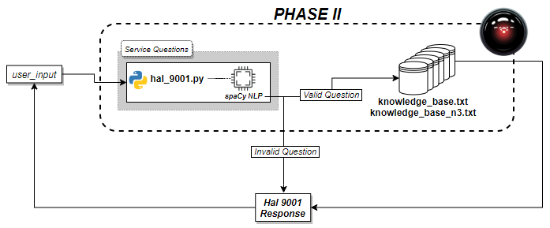

___Concordia University, Winter 2020, COMP474_project___
___________________________________________
# [--- PHASE I ---]

### DELIVERABLES
_The following discribes which file belong to which deliverable._
#### RDF Schema;
schema.ttl
#### Dataset;
database.txt
___________________________________________
### INSTALLATION 
_Instructions displayed below are from a Linux-Debian machine using a Bash terminal. It is important to note that this repository has the knowledge_base which is created from exeucting this installation step; this section is for documentation purposes._
#### Database Construction;
database_builder.py - Please use the following command to install python's dependencies.
>pip3 install -r [path-to-project]/COMP474_project1/requirements.txt
#### Knowledge Graph Creation;
parse.py - Builds the Knowledge Graph with a docker image of DBpedia Spotlight running locally. Use the following command to RUN DOCKER LOCALLY
>sudo docker run -i -p 2222:80 dbpedia/spotlight-english spotlight.sh
___________________________________________
### RUNNING PROGRAM
#### Queries;
query.py - Allows a user to query Knowledge Graph with questions from the Assignment 1 description. To run a query.py, use the following command
>python3 query.py
#### Queries and their results;
- Queries; found in [path-to-project]/COMP474_project1/queries directory
- Results; found in the [path-to-project]COMP474_project1/results directory
___________________________________________
# [--- PHASE II ---]

### DELIVERABLES
_The following discribes which file belong to which deliverable._
#### Chatbot;
hal_9001.py
___________________________________________
### INSTALLATION 
_This installation section is necessary if the user would like to run the Chatbot_
#### Hal 9001 dependencies;
hal_9001.py requires the user to install spaCy via the pip3 package manager. SpaCy is an open-srouce Natural Language Processing library which is leverage in this Chatbot in order to determine what type of question is being asked.
>pip3 install -r [path-to-project]/COMP474_project1/requirements.txt
___________________________________________
### RUNNING PROGRAM
#### HAL 9001 (Chatbot);
Once executing the command below in terminal which is in the [path-to-project]/COMP474_project1 directory, it will take approximately 10-15 seconds until the program is ready for questions. This is due to the loading of the medium size english database used for spaCy NLP processing (_hal_9001.py_, line 10)
>python3 hal_9001.py

Hal 9001 is capable of answering questions which resemble: 
___Note: the Chatbot is case sensistive___
1. What is the < Course > about? (i.e. < Course > = COMP474)
2. Which courses did < Student_ID > take? (i.e. < Student_ID > = 20)
3. Which courses cover < Topic >? (i.e. < Topic > = Artificial intelligence)
4. Who is familiar with < Topic >? (i.e. < Topic > = Montreal)

